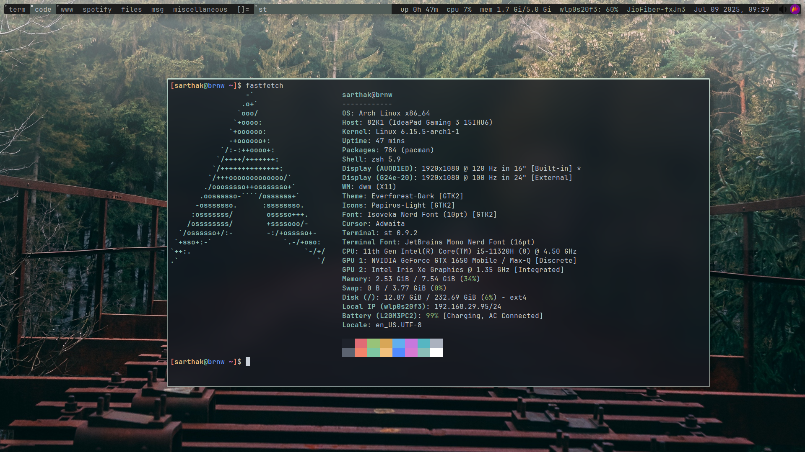

# evergruv-wm

A modular, suckless-inspired window management setup using `dwm`, `st`, `dmenu`, `rofi`, `picom`, and `slstatus` — themed with Evergruv (Everforest × Gruvbox). This repo contains custom builds, configs, and wallpapers to create a clean and minimal Linux WM experience.

---

## 🖼️ Screenshot



> Preview of dwm + slstatus + rofi + picom + st + wallpaper

---

## 📦 Components

| Tool       | Purpose                    |
|------------|----------------------------|
| `dwm`      | Tiling window manager (patched)  
| `st`       | Simple terminal (patched)  
| `dmenu`    | Lightweight application launcher  
| `rofi`     | GUI launcher / power menu  
| `picom`    | Compositor (transparency, shadows)  
| `slstatus` | Custom status bar  
| `gtk-2.0`  | GTK theming  
| `wallpapers` | Minimal aesthetic images  

---

## 📁 Repo Layout

```bash
~/.config/evergruv-wm
├── dmenu/
├── dwm/
├── gtk-2.0/
├── picom/
├── rofi/
├── slstatus/
├── st/
├── wallpapers/
└── .assets/
````

---

## ⚙️ Dependencies

<details>
<summary><strong>Arch-based Systems (Pacman)</strong></summary>

```bash
sudo pacman -S --needed base-devel libx11 libxft libxinerama \
  libxrandr libxrender libxext harfbuzz fontconfig \
  rofi picom feh xorg xorg-xinit
```

</details>

<details>
<summary><strong>Debian-based Systems (APT)</strong></summary>

```bash
sudo apt install build-essential libx11-dev libxft-dev libxinerama-dev \
  libxrandr-dev libxrender-dev libxext-dev libharfbuzz-dev \
  libfontconfig-dev rofi picom feh xinit xorg
```

</details>

---

## 🛠️ Installation

```bash
# Clone into .config
git clone https://github.com/sarthakbrnw/evergruv-wm ~/.config/evergruv-wm
cd ~/.config/evergruv-wm

# Build and install core suckless components
for dir in dmenu dwm st slstatus; do
  cd $dir && sudo make clean install && cd ..
done

# Copy configs
mkdir -p ~/.config/rofi ~/.config/picom
cp rofi/config.rasi ~/.config/rofi/
cp picom/picom.conf ~/.config/picom/
cp gtk-2.0/* ~/.gtkrc-2.0
mkdir -p ~/Pictures/Wallpapers
cp -r wallpapers/* ~/Pictures/Wallpapers/
```

---

## 🚀 Autostart (`.xinitrc`)

Add this to your `~/.xinitrc`:

```bash
#!/bin/sh
picom --config ~/.config/picom/picom.conf &
slstatus &
feh --bg-scale ~/Pictures/Wallpapers/evergruv-01.jpg &
exec dwm
```

Then start X with:

```bash
startx
```

---

## 🧠 Customization

* `~/.config/evergruv-wm/dwm/config.h` — keybindings, gaps, layout
* `~/.config/evergruv-wm/st/config.h` — font, colors, terminal behavior
* `~/.config/evergruv-wm/slstatus/config.h` — status bar modules
* `~/.gtkrc-2.0` — GTK2 theming
* `~/.config/rofi/config.rasi` — menu style and fonts

> After editing any `config.h`, rebuild the component using:

```bash
cd <component> && sudo make install
```

---

## 📄 License

This project is licensed under the **GNU GPL v3**. See [LICENSE](./LICENSE) for full terms.

---

## 🙋‍♂️ Author

**Sarthak Baranwal**
📧 [sarthak.brnw@proton.me](mailto:sarthak.brnw@proton.me)
🔗 [github.com/sarthakbrnw](https://github.com/sarthakbrnw)

---

## ⭐️ Like it?

Give it a ⭐, fork it, rice it, and tag me if you post your setup!

```

